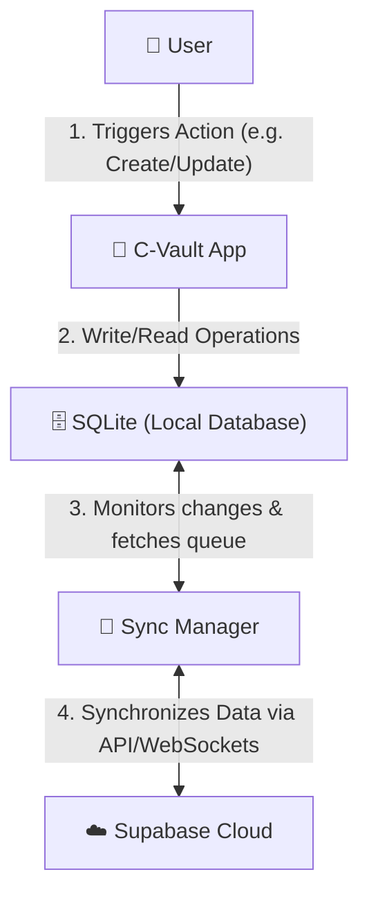

# Database & Synchronization Flow

This document details the flow of data creation, local storage, and cloud synchronization within the C-Vault system.

## System Architecture Flow

The data propagates through the following layers of the application:

---

## Detailed Component Flow

### 1. User Interaction
* The **User** performs an action inside the **C-Vault App** (e.g., adds an expense, updates a category, or creates a profile).

### 2. C-Vault App (Local-First Presentation Layer)
* The application processes the request.
* To ensure offline-first capability and high performance, the app immediately writes the data directly to the local **SQLite Database**.
* The UI is updated instantly based on this local state, providing a zero-latency experience for the user regardless of network conditions.

### 3. SQLite (Local Database)
* Acts as the primary source of truth for the client application.
* Stores transaction logs, pending sync queues, and application states.
* Marks new or updated records with sync flags (e.g., `dirty = true`, `sync_status = 'pending'`).

### 4. Sync Manager
* Runs in the background (or triggers upon network state restoration).
* Queries the SQLite database for any records flagged as pending synchronization.
* Handles conflict resolution, retry logic, and batching of network requests.
* Once a sync is successfully acknowledged by the cloud, updates the local SQLite records to set `dirty = false` or `sync_status = 'synced'`.

### 5. Supabase Cloud (Remote Database)
* Acts as the global, centralized source of truth.
* Receives changes from the **Sync Manager** and persists them to the PostgreSQL instance hosted on Supabase.
* Emits real-time database updates or conflicts back to the Sync Manager if multi-device sync is enabled.
